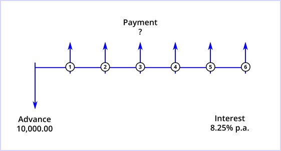

# Curo Calculator
[](https://travis-ci.org/andrewmurphy353/curo-calculator)
[](https://coveralls.io/github/andrewmurphy353/curo-calculator?branch=master)


A financial calculator for solving unknown cash flow values and unknown interest rates implicit in fixed-term instalment credit products, for example leasing, loans and hire purchase contracts [1].

## Overview

This calculator library is available as a Typescript package and supports features that are likely to be found only in commercially developed software. It has been designed for use in web applications with requirements that extend beyond what can be achieved using standard financial algebra.

A number of usage demos are [hosted at Stackblitz](https://stackblitz.com/@andrewmurphy353) to provide a quick and interactive introduction to various calculator features. Please refer to the [demo README](https://github.com/andrewmurphy353/curo-calculator-demo/blob/master/README.md) document at GitHub as it provides contextual information, additional configuration options, and a cash flow diagram [2] to help you visualise the inputs and unknowns in each calculation scenario.

Using the calculator couldn't be simpler, as demonstrated by the following 3-step example that solves for an unknown payment value.

```ts
// Step 1. Instantiate the calculator
const calc = new Calculator();

// Step 2. Define each cash flow series
calc.add(
  SeriesAdvance.builder()
    .setLabel("Loan advance")
    .setAmount(10000.0)
    .build()
);
calc.add(
  SeriesPayment.builder()
    .setNumberOf(6)
    .setLabel("Instalment")
    .setAmount(undefined) // or simply omit setter method 
    .setMode(Mode.Arrear)
    .build()
);

// Step 3. Calculate the unknown payment value
const pmtResult = calc.solveValue(new US30360(), 0.0825);
```
In this example you may have noticed that the payment series amount is `undefined`. This is intentional and is the approach you must follow when defining the unknown cash flow values you wish to calculate.

In the final step we invoke the `solveValue(...)` method, passing in a day count convention instance and the annual interest rate to use in the calculation, expressed as a decimal.

To determine the interest rate implicit in a series containing known cash flow values, simply pass in an appropriate day count convention instance to the `solveRate(...)` method, for example:

```ts
const irrResult = calc.solveRate(new US30360());
```
or

```ts
const aprResult = calc.solveRate(new EU200848EC());
```

Finally, a quick explanation of the day count convention's referred to above. A day count convention is a key component of every financial calculation as it determines the method to be used in measuring the time interval between each cash flow in a series. There are dozens of convention's defined but the more important ones supported by this calculator are as follows:

Convention | Description
-----------| -------------
Actual ISDA | Convention accounts for actual days between cash flow dates based on the portion in a leap year and the portion in a non-leap year as [documented here](https://en.wikipedia.org/wiki/Day_count_convention#Actual/Actual_ISDA).
Actual/365 | Convention accounts for actual days between cash flow dates and considers a year to have 365 days as [documented here](https://en.wikipedia.org/wiki/Day_count_convention#Actual/365_Fixed).
EU 30/360 | Convention accounts for days between cash flow dates based on a 30 day month, 360 day year as [documented here](https://en.wikipedia.org/wiki/Day_count_convention#30E/360). 
EU 2008/48/EC | Convention based on the time periods between cash flow dates and the initial drawdown date, expressed in days and/or whole weeks, months or years. This convention is used specifically in APR (Annual Percentage Rate) consumer credit calculations within the European Union and is compliant with the EU2008/49/EC directive [available here](https://publications.europa.eu/en/publication-detail/-/publication/e4945793-f1f9-4527-8a2e-9060378fc302/language-en#).
US 30/360 | Convention accounts for days between cash flow dates based on a 30 day month, 360 day year as  [documented here](https://en.wikipedia.org/wiki/Day_count_convention#30/360_US). This is the default convention used by the Hewlett Packard HP12C and similar financial calculators, so choose this convention if unsure as it is the defacto convention used in the majority of fixed-term credit calculations.

By default all conventions, except EU 2008/48/EC, compute time intervals between cash flows with reference to the dates of adjacent cash flows.

To perform XIRR (eXtended Internal Rate of Return) based calculations, where time intervals are computed with reference to the first drawdown date, simply pass the appropriate argument to the respective day count convention constructor (refer to code documentation for details). When the Actual/365 convention is used in this manner the XIRR result equals that produced by the equivalent Microsoft Excel XIRR function.

## Installation

To install the library as a project dependency use the following command:

```shell
npm install --save @curo/calculator
```

## Running Tests

To run the tests clone or fork the GitHub repository and use the following commands:

```shell
npm install
npm test
```

## License

Copyright © 2019, [Andrew Murphy](https://github.com/andrewmurphy353).
Released under the [MIT License](LICENSE).

### Footnotes
---

[1] Whilst the library uses asset finance nomenclature, it is equally capable of solving problems in investment-type scenarios.

[2] A cash flow diagram is simply a pictorial representation of the timing and direction of financial transactions and is a diagramming technique used throughout the [various demos hosted at Stackblitz](https://stackblitz.com/@andrewmurphy353).

The diagram begins with a horizontal line, called a time line. The line represents the duration or contract term, and is commonly divided into compounding periods. The exchange of money in the financial arrangement is depicted by vertical arrows. Money a lender receives is represented by an arrow pointing up from the point in the time line when the transaction occurs; money paid out by the lender is represented by an arrow pointing down. The collection of all up and down arrow cash flows are what is referred to throughout the calculator documentation as a cash flow series.

To illustrate, suppose you needed to calculate the monthly repayments on a 10,000.00 loan payable over 6 months at an interest rate of 8.25% effective per annum. Assuming the payments are due in arrears, that is at the end of each compounding period, the cash flow diagram describing the problem would look like this:



To translate this data into a format understood by the calculator is now a straightforward exercise - if the diagram looks vaguely familiar it is because it represents the unknown payment problem demonstrated in the 3-step code example above!
